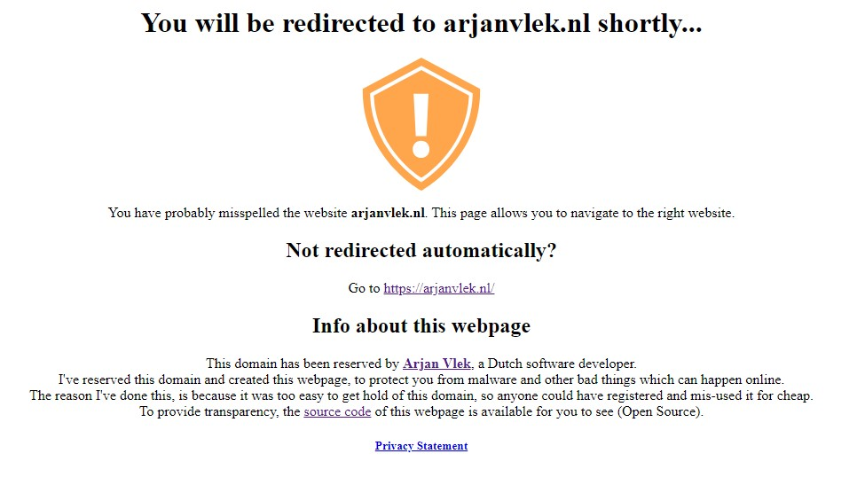
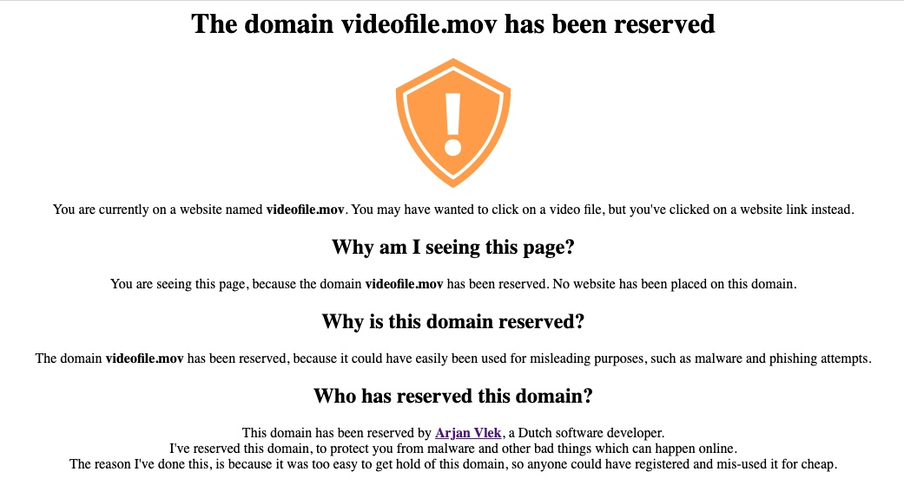
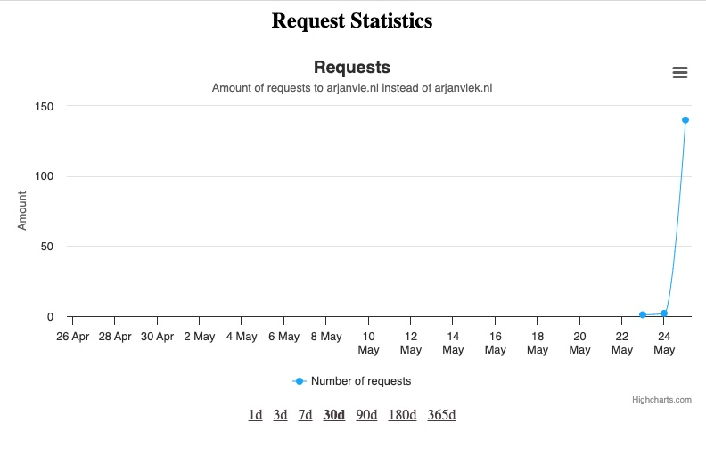

# Domain security issue prevention app

Web application which can be used to perform 2 tasks:
- Redirect users of misspelled domains to correctly-spelled domains
- Warn users of misleading domains

## Redirection of misspelled domains

If the user navigates to misspelled domain (e.g. [arjanvle.nl](arjanvle.nl)), the app will auto-redirect the user to the right domain (e.g. [arjanvlek.nl](arjanvlek.nl)).

Before this happens, an informational page with access to the privacy information will be shown:

For the administrator, we will log how often this has happened. This provides insight in how often users
were led to a wrong domain.

## Warning of misleading domains

If the user navigates to a misleading domain (e.g. [videofile.mov](videofile.mov)), the app will show a landing
page to inform the user of what just happened.

For the administrator, we will log how often this has happened. This provides insight if users often click on
a misleading link.

## Statistics page for administrators

**This page is secured on the webserver with a username and password which only the administrator knows.**

The site administrator can see how many requests (either redirects or landing pages) have been performed. 
This provides insight how many times a misspelled or misleading website is opened by users.

If the administrator navigates to `/request-stats`, the app will provide a graph of how many requests were sent
to the domain per day.

Only the redirects or rendered landing pages will be counted. Other requests, such as website images, robots.txt
and requests to the statistics page, will not be counted.

Minimal user data is collected in order to provide the counts:
- IP Address
- User agent of the browser
- Date/time of the request
- URL requested on the domain (if any)
- Referring website (if any)

This is nothing more than what would be logged by a typical Web server's access log. 
This data, except of a daily count number, is not returned anywhere, in order to protect user privacy.

