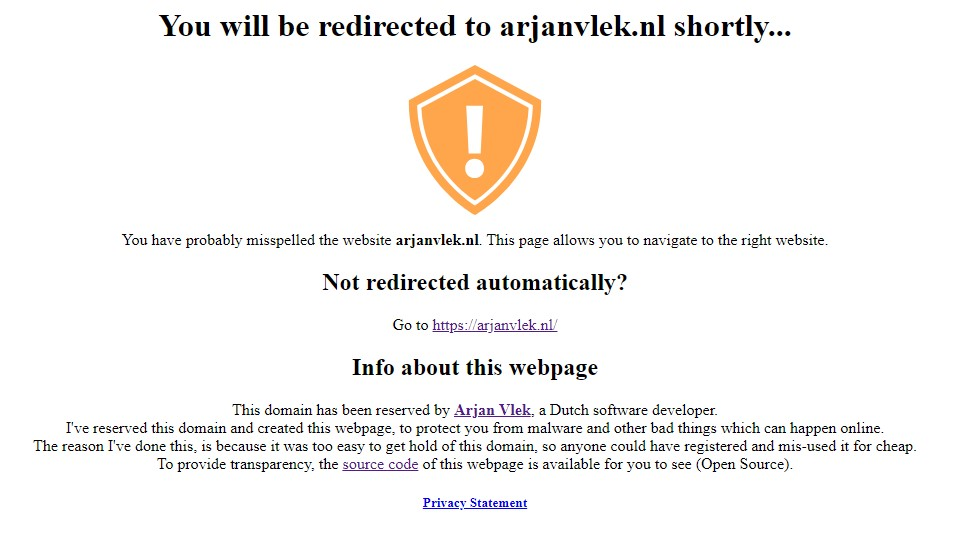
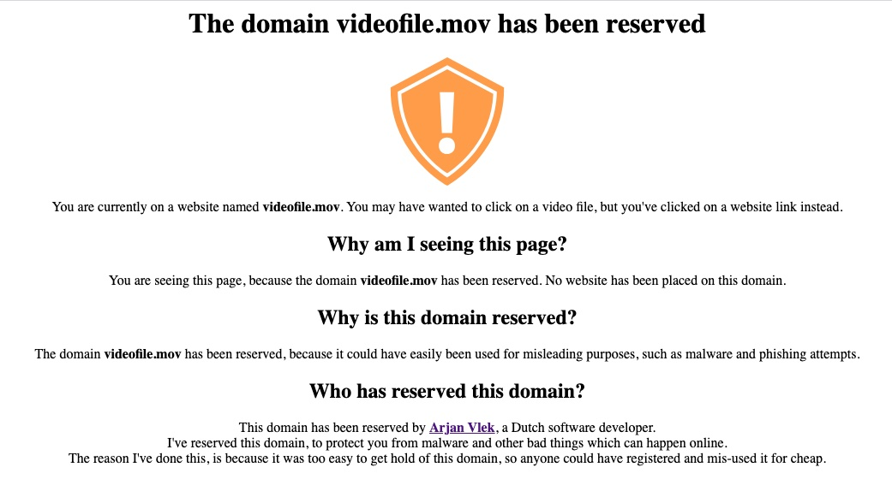
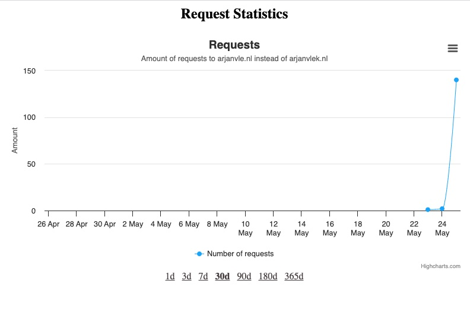

# Domain Security Issues Prevention

A tool for website administrators to warn users about misspelled / misleading domains.
Provides minimal statistics how often such domains are reached, designed with user privacy in mind.

This is a Node.js web application which can be used in 2 different scenarios:
- Redirect Mode: Redirects users of a misspelled domain to the correctly spelled domain
- Placeholder Mode: Warns users about a misleading domain

This tool requires you to purchase the misspelled or misleading domain yourself, and 
set a `A` DNS record to the IP address of the server that is hosting this application.

## Redirect Mode

If the user navigates to misspelled domain (e.g. [arjanvle.nl](arjanvle.nl)), the app will auto-redirect the user to the right domain (e.g. [arjanvlek.nl](arjanvlek.nl)).

Before this happens, an informational page with access to the privacy information will be shown:

For the administrator, we will log how often this has happened. This provides insight in how often users
were led to a wrong domain.

## Placeholder Mode

If the user navigates to a misleading domain (e.g. [videofile.mov](videofile.mov)), the app will show a landing
page to inform the user of what just happened.

For the administrator, we will log how often this has happened. This provides insight if users often click on
a misleading link.

## Statistics Page (for administrators)

**This page must be secured on the webserver with a username and password which only the administrator knows.**

The site administrator can see how many requests (either redirects or landing pages) have been performed. 
This provides insight how many times a misspelled or misleading website is opened by users.

If the administrator navigates to `/request-stats`, the app will provide a graph of how many requests were sent
to the domain per day.

It is **important** to secure this URL with some sort of authentication, such as Apache or NGINX basic authentication.
This project itself does not provide any form of authentication.

Only the redirects or rendered landing pages will be counted. Other requests, such as website images, robots.txt
and requests to the statistics page, will not be counted.

Minimal user data is collected in order to provide the counts:
- IP Address
- User agent of the browser
- Date/time of the request
- URL requested on the domain (if any)
- Referring website (if any)

This is nothing more than what would be logged by a typical Web server's access log. 
This data, except of a daily count number, is not returned anywhere, in order to protect user privacy.

## Configuring the app (for administrators)

Adjust the section `DEFAULT_CONFIG` in the file `index.js`. Set the correct mode (`redirect` or `warn_user`). 
Then, set either `REDIRECT_DOMAIN` or `WARN_USER_DOMAIN_NAME`. Finally, adjust all texts to match your domain name.
